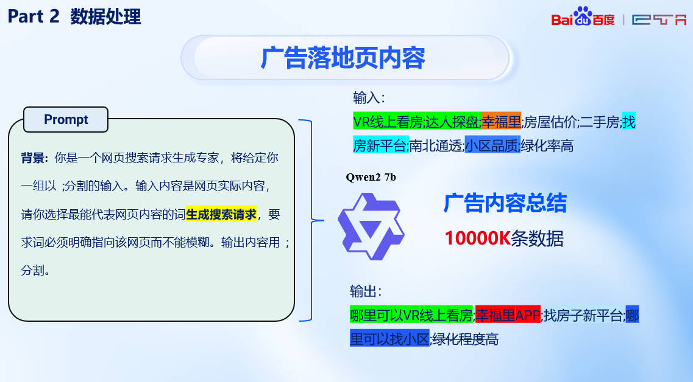

# 2024-BaiduAI-LLM-DSI 生成式检索/Differential Search Index🤠
2024百度商业AI技术创新大赛赛道一：基于大模型的广告检索全国一等奖获奖方案
比赛链接：https://aistudio.baidu.com/competition/detail/1188/0/task-definition
# 赛题背景 🤩
本次比赛提供了百度真实的广告数据集，包含了海量的用户点击数据和广告特征。 希望参赛者使用指定的生成式模型 (Unimo-text-large) 或双塔模型（Ernie-3.0-xbase) 底座，采用双塔度量式检索或生成式检索建模广告召回任务，完成相关广告的召回。 任务的目标是基于候选广告特征，在给定搜索词下预估最应召回的 K 个广告，评估召回率；选手同时需要考虑算法效果和算法性能

## 数据集介绍 🤗
本次比赛提供3个数据集：
* 点击训练集：前 N-1 天的网民搜索词（Query） - 广告 ID的点击数据，即点击次数（注意：点击次数经真实数据脱敏处理，仍能反映点击倾向）
* 验证集：第N天的点击数据抽样
* 广告特征：包含全部广告的落地页特征、核心词特征
**评测使用的数据采用另一组第 N 天点击数据抽样，即与提供的验证数据集同分布**
> 落地页特征为客户托管页面的内容（该页面托管在百度，且图片信息经过了OCR识别）
> 核心词特征基于百度商业积累，对广告投放页面提取的业务关键字。
## 评估指标 🤔
本次赛题从策略效果和推理效率两个维度综合评估模型效果。
**策略效果评估**： 采用召回率@TopK: 召回率定义为在前 k 个返回结果中，相关广告的比例。
$\mathrm{CRR@}K=\frac{\sum_{a\in(R_k\cap C)}\mathrm{Clicks}(a)}{\sum_{a\in C}\mathrm{Clicks}(a)}$
* R_k是召回广告集合 R 中排序后取前K个广告的子集。
* C 是实际点击的广告集合。
* R∩C 是 召回广告集合与实际点击广告集合的交集，即被召回且被点击的广告集合。
* Clicks(a)表示广告 aa 被点击的次数。

策略效果同时评估Recall@5和Recall@10，加权打分如下：

$score_{recall}=CRR@5\times0.6+CRR@10\times0.4$

**推理效率评估**： 参赛者提交inference脚本后，会通过统计inference脚本的运行时间，来计算在测试集上单条样本的平均推理时间。推理效率打分采用如下公示，如果平均推理时间超过定义的时间限制，则推理效率得分为0。

**比赛总分：** 策略指标和推理效率打分权重比例为7：3。

> 因此实际的要求需要同时优化推理速度以及优化模型指标

# 解决思路 🤯
## 问题分析 🥸
> 将网页落地页称为 **Document**，用户搜索词称为 **Query** 

在初赛阶段发现直接使用较长的Document对于增加模型生成式检索能力没有帮助，反而是较短的Query能快速提升模型检索能力。

我们通过分析得出**广告落地页数据较为杂乱**（通常为OCR处理），主要问题在于：
1. 落地页中存在大量混杂信息而无法精确反映出用户意图，甚至很多query对应的页面内容并不显式包含query信息——低质量的落地页
2. query和document长度差距较大，而测试时只有query应该更模拟测试场景
3. 需要尽量补充符合query分布的数据

此外，通过分析用户的点击率我们发现很多广告仅有一到两条点击数据而部分广告有多条，我们**需要通过数据增强解决这样的长尾问题。**

## 解决方案 🤥
### 数据增强策略 😶‍🌫️
针对以上提出的问题，我们通过大模型生成的方式进行解决，具体来说选择了中文能力较强+有较小版本的Qwen模型进行数据增强，包括：

1. **Doc2query**：将广告落地页进行拆分并形成合理的query
2. **优化长尾**： 补充点击率较低的广告query
3. **拆分广告核心词**：将数据集中的核心词也作为query进行训练

### 训练优化策略 👽
基于已有实践和论文我们发现，单纯按顺序一个一个数据集（即我们通过不同方式得到的Query数据集）训练模型并不会导致模型效果提升，反而会降低模型效果。
因此我们提出**多任务训练**的策略，即在训练时来回交替不同数据集来源的Batch进行训练，以保证模型在训练过程中对不同分布的query都能保持很好的鲁棒性。

### 性能表现 👻

# 总结 🤖
在数据上我们选择了本地部署小模型，这带来了我们处理数据量的优势；同时我们挖掘了不同数据之间分布的问题，并考虑模型优化难度提出了多任务学习的方式，经实践验证十分有效～
比赛的成功离不开团队的通力合作和技术创新，我们希望这些经验能够为后续比赛者提供一些参考和启发

更详细的说明欢迎参考小红书[Trae1oung](https://www.xiaohongshu.com/user/profile/6130728d000000000201b3fe)之前发布的技术文章

本仓库主要基于百度Ai Studio平台和PaddlePaddle框架，代码已开源但没法直接运行，个人认为整体思路以及推理优化值得参考，欢迎交流~
需要获取完整数据集欢迎联系我， yuqiaot@std.uestc.edu.cn / tanyuqiao2025@ia.ac.cn